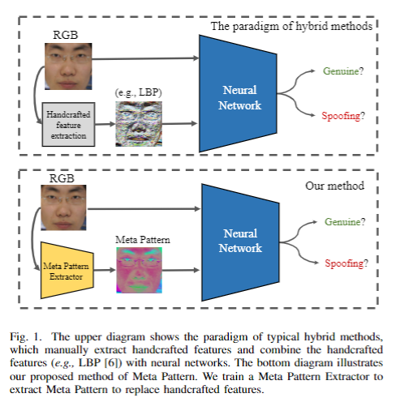

# MetaPattern_FAS
The code repo for the paper ["Learning Meta Pattern for Face Anti-Spoofing", IEEE TIFS 2022](https://ieeexplore.ieee.org/document/9732458)   /  [(ArXiv version)](https://arxiv.org/pdf/2110.06753.pdf). 


# Steps for reproduction
## Data extraction
1. Please download the datasets you need. Due to the license, I cannot redistribute the datasets. You have to download the datasets by submitting your requests. The links for downloading the datasets can be found in  https://github.com/RizhaoCai/Awesome-FAS.
2. Configure directories  
2.1 Go to [data/extract_frames_mtcnn.py](data/extract_frames_mtcnn.py)  
2.2 Configure the MTCCN path (check line 14 of [data/extract_frames_mtcnn.py](data/extract_frames_mtcnn.py))  
2.3 Check lines 22 and 23. Configure `ROOT_DIR` and `SAVE_DIR`  
3. Run scripts to extract data frames  
    ```shell
    cd data
    # Change the DATASET_NAME you need; Check the keys of the dict 'DATASET_DIR' in data/extract_frames_mtcnn.py
    DATASET_NAME='CASIA-FASD'; python extract_frames_mtcnn.py ${DATASET_NAME}
    cd ..
    ```
4. Configure default configs in [config/defaults.py](config/defaults.py)  
This file provide many basic configs for data, network, and training. Some model-specific/custom configs are in each sub-folders of [models] (e.g. [models/HFN_MP/custom_config.py](models/HFN_MP/custom_config.py)). Custom configs will be merged with the deafult config.

Please configure `_C.DATA.ROOT_DIR` in [config/defaults.py](config/defaults.py), which is the root directory where you save the preprocessed data.

## Run training

```shell
# Train models for the C+I+O to M protocol
python train.py --trainer HFN_MP --config models/HFN_MP/CIO-M.yaml OUTPUT_DIR output/HFN_MP/CIO-M/NF2_align_InnerLoops4 TRAIN.NUM_FRAMES 2 TEST.NUM_FRAMES 2 TRAIN.INNER_LOOPS 4 TRAIN.META_LEARNING_RATE 0.001 TRAIN.IMAGENET_PRETRAIN True 
```

# Citation
If you use this repo, please kindly cite the below papers
```
@article{cai2022learning,
  title={Learning Meta Pattern for Face Anti-Spoofing},
  author={Cai, Rizhao and Li, Zhi and Wan, Renjie and Li, Haoliang and Hu, Yongjian and Kot, Alex C},
  journal={IEEE Transactions on Information Forensics and Security},
  volume={17},
  pages={1201--1213},
  year={2022},
  publisher={IEEE}
}


@article{cai2020drl,
  title={DRL-FAS: A novel framework based on deep reinforcement learning for face anti-spoofing},
  author={Cai, Rizhao and Li, Haoliang and Wang, Shiqi and Chen, Changsheng and Kot, Alex C},
  journal={IEEE Transactions on Information Forensics and Security},
  volume={16},
  pages={937--951},
  year={2020},
  publisher={IEEE}
}

```